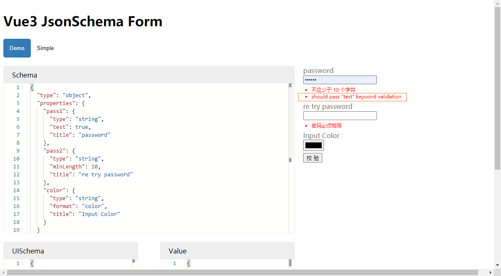

>https://github.com/Jokcy/vjsf-imooc

##
```shell script
vue create vue3-json-schema-form
```

+ class-style 是vue2.x的装饰器写法

##
>arrowParens
>
>arrowParens Include parentheses around a sole arrow function parameter.
>
>parents 这里是括号的意思

##
```shell script
npm i ajv
```
```shell script
npm i ajv-i18n
npm i @types/ajv-i18n -D
```
+ 转换错误提示语言

```shell script
npm i ajv-erros
```
+ 自定义错误信息

##
```shell script
npm i -D monaco-editor

npm i vue-jss
npm i jss jss-preset-default
```
+ vue-jss这是讲这课的2b老师自己封装的

##
```shell script
vue upgrade
```

##
解决 monaco-editor 控制台报错
```shell script
npm i monaco-editor-webpack-plugin -D
```

##
```shell script
npm i jsonpointer
npm i lodash.union
npm i json-schema-merge-allof

npm i @types/lodash.union @types/json-schema-merge-allof -D
```

## 循环引用提醒
```shell script
npm i circular-dependency-plugin -D
```
##
```shell script
npm i cross-env -D
```
```shell script
npm i rimraf -D
```

##
setup里声明的ref什么的,在外面(其它组件里)获取不到,vue也没有提供this.$xx什么的来获取

##
```shell script
npm i lodash.topath -D
npm i @types/lodash.topath -D
```

## todo
我们这种自定义keyword的方式 会导致多出一行错误提示



## Github Action
>github.com/features/actions

## codecov.io
>codecov.io

推送后会自动上传到codecov

我们可以通过一下链接访问到

>https://codecov.io/gh/你的github名字/你的仓库名/branch/哪个分支
