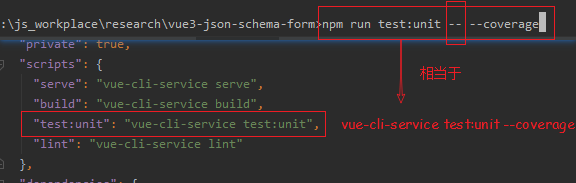
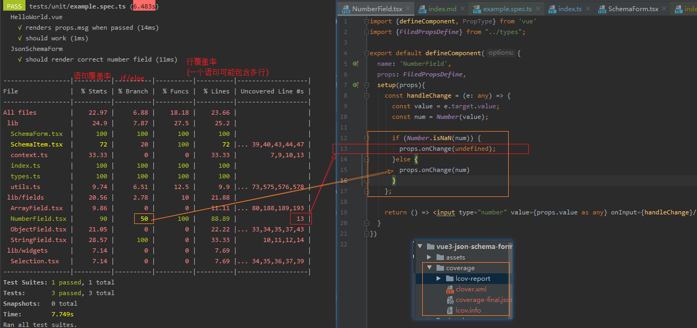

```shell script
npm run test:unit -- --testNamePattern=^ArrayFiled
```
```shell script
"D:\Program Files\nodejs\node.exe" --require "D:\Program Files\JetBrains\WebStorm 2019.3.1\plugins\JavaScriptLanguage\helpers\jest-intellij\lib\jest-intellij-stdin-fix.js" F:\js_workplace\research\vue3-json-schema-form\node_modules\@vue\cli-service\bin\vue-cli-service.js test:unit --colors --reporters "D:\Program Files\JetBrains\WebStorm 2019.3.1\plugins\JavaScriptLanguage\helpers\jest-intellij\lib\jest-intellij-reporter.js" --verbose "--testNamePattern=^ArrayFiled " --runTestsByPath F:/js_workplace/research/vue3-json-schema-form/tests/unit/ArrayField.spec.ts
```
+ runTestsByPath
+ testNamePattern
